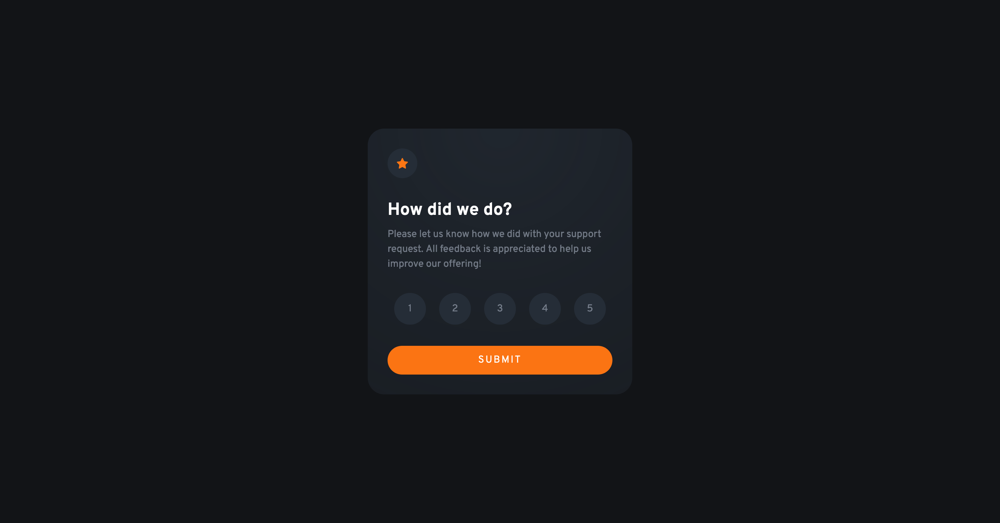

# Frontend Mentor - Interactive rating component solution

This is a solution to the [Interactive rating component challenge on Frontend Mentor](https://www.frontendmentor.io/challenges/interactive-rating-component-koxpeBUmI). Frontend Mentor challenges help you improve your coding skills by building realistic projects. 

## Table of contents

- [Overview](#overview)
  - [The challenge](#the-challenge)
  - [Screenshot](#screenshot)
  - [Links](#links)
- [My process](#my-process)
  - [Built with](#built-with)
  - [What I learned](#what-i-learned)
  - [Continued development](#continued-development)
- [Author](#author)

## Overview

### The challenge

Users should be able to:

- View the optimal layout for the app depending on their device's screen size
- See hover states for all interactive elements on the page
- Select and submit a number rating
- See the "Thank you" card state after submitting a rating

### Screenshot



### Links

- Solution URL: [Github repo here](https://github.com/nicholasboyce/interactive-rating-component)
- Live Site URL: [Github pages here](https://nicholasboyce.github.io/interactive-rating-component)

## My process

### Built with

- Semantic HTML5 markup
- CSS custom properties
- Flexbox
- CSS Grid
- Mobile-first workflow

### What I learned

I'm proud of this CSS which uses custom properties to minimize JS:

```css
.card {
    --_ratings-display: var(--ratings-display, grid);
    --_thanks-display: var(--thanks-display, none);
    max-width: var(--card-max-width);
    border-radius: var(--border-radius);
    background-image: radial-gradient(
        circle at top,
        hsl(var(--clr-neutral-700-hsl), 0.7) 6%, 
        hsl(var(--clr-neutral-700-hsl), 0.4) );
    margin: 1rem;
    padding: calc(var(--padding) * 1.25);
}

.card.thanks-state {
    --_ratings-display: none;
    --_thanks-display: grid;
}

.rating {
    display: var(--_ratings-display);
    gap: 2rem;
}

.thanks {
    display: var(--_thanks-display);
    gap: 2rem;
    text-align: center;
    justify-items: center;
    margin: 0.75rem 0;
}
```

### Continued development

I'm feeling a bit more confident that I can mix decent designs with interactivity. I was nervous about doing this one, but I realized I was overthinking it! The gradient on the card was a bit tricky for me, but I had to realize that we only receive the base colors and it's up to us to mix them up in the ways we need to in order to recreate the design. Custom properties came in handy!


## Author

- Frontend Mentor - [@nicholasboyce](https://www.frontendmentor.io/profile/nicholasboyce)

